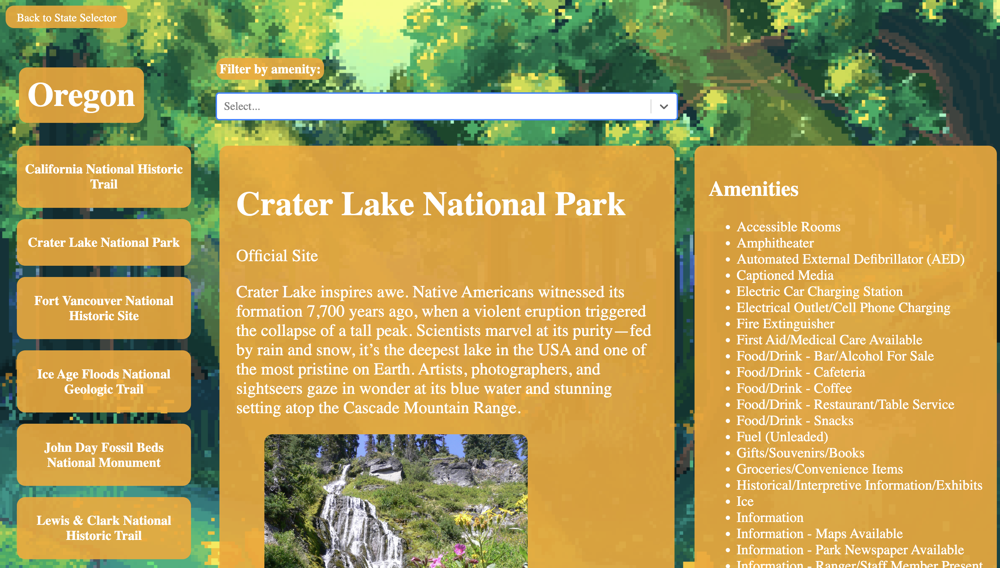

# National Park Explorer

[Click here to start exploring!]()

## Description

Utilizing the [National Park Service API](https://www.nps.gov/subjects/developer/index.htm), this app allows you to explore national parks, as well as other sites managed by the National Park Service, by state. Upon opening the app, you will see a map of the United States. Click on a state to view its national parks and sites. Then, click on a park or site to view its details. Details include a description, a link to its official site, images, and amenities (such as restrooms, parking, etc).

## Technologies Used

## Screenshots

## Getting Started

[Check out the app here!]()

If you would like to run the application locally, you can do so by [cloning](https://docs.github.com/en/repositories/creating-and-managing-repositories/cloning-a-repository) it onto your device. Be sure to run `npm i` to download the necessary packages. Then, you can run `npm start` to run the application locally.

Current plans for the app can be viewed [here](https://trello.com/invite/b/ppzQni2M/ATTI78a29981bca8acc5b41a8665bf61cd93F66F11C3/capstone). This includes user stories, wireframes, and an entity-relationship-diagram.

## Contribution Guidelines

Feel free to expand upon this app! Just [fork](https://docs.github.com/en/get-started/quickstart/fork-a-repo) the repository and create a [pull request](https://docs.github.com/en/pull-requests/collaborating-with-pull-requests/proposing-changes-to-your-work-with-pull-requests/creating-a-pull-request) with any updates you've made.

## Future Enhancements

- Implement OAuth, so users can login and save national parks they want to visit.
- Display current weather data when viewing a park's details.
- Allow users the ability to filter a state's parks based on available amenities.
